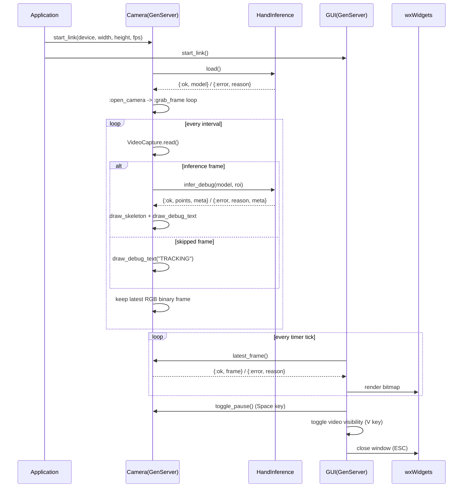
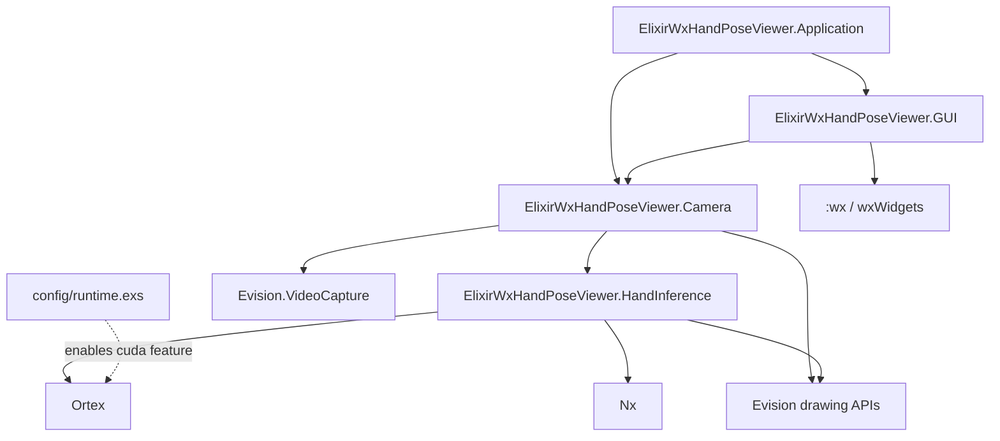

# ElixirWxHandPoseViewer Architecture

## シーケンス図

この図は、アプリ起動後に各プロセスがどの順番でやり取りするかを示しています。

- `Application` は `Camera` と `GUI` を起動するだけで、実処理は子プロセスへ委譲します。
- `Camera` は一定間隔でフレーム取得を繰り返し、推論対象フレームでは `HandInference` を呼び出します。
- `GUI` は別タイマーで `Camera.latest_frame/0` を呼び、描画更新を行います。
- キー入力（`Space` / `V` / `ESC`）は `GUI` が受け取り、必要に応じて `Camera` 制御や表示切替を行います。
- 推論失敗時も処理ループは継続し、ステータス表示だけを切り替える設計です。

## モジュール関係図

この図は、モジュールの責務分離と依存方向を示しています。

- `Application` は依存注入の起点で、`Camera` と `GUI` の supervised 起動を担当します。
- `Camera` は I/O（カメラ取得）と推論呼び出しのハブです。
- `HandInference` は前処理・推論・後処理をまとめた純粋な推論責務を持ちます。
- `GUI` は表示と入力処理に専念し、推論ロジックを直接持ちません。
- 外部依存は `Evision`（画像処理/描画）、`Ortex`/`Nx`（推論）に集約されています。
- `runtime.exs` は `Ortex` の実行機能（例: CUDA feature）を環境変数に応じて切り替える設定点です。

